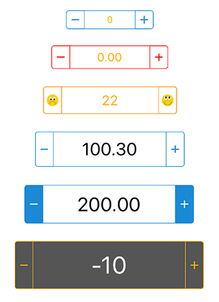

# UIStepperController

This is an Xamarin iOS port of [UIStepperController](https://github.com/NadeeshanEngineering/UIStepperController) created by [NadeeshanEngineering](https://github.com/NadeeshanEngineering);All credits goes to him 

UIStepperController is a custom class that written to draw / design an awesome Stepper Controller with easy approach. further more it capable of holding either numeric or floating numbers, and developer can customize the stepper controller with attributes such as size, border color, background color, font color etc. Class is based on Swift language and require UIKit framework for function the functionalities.

## Screenshot

## License
UIStepper is available under the [MIT License](https://en.wikipedia.org/wiki/MIT_License). See the [LICENSE](./LICENSE) for details.
